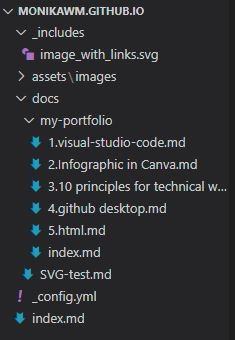

# HTML

<b>HTML</b> - HyperText Markup Language - is a code using to create a website and a website content. HTML allows to download files with the possibility of entering a doc page. HTML is not a programming language, it is a markup language. HTML consist of a series of tags that are used to enclose different parts od content. Because of tags we can do hyperlinks, we can edit text to bold, italic, larger, etc. [Read more](https://www.w3schools.com/html/)

# Publising content in HTML format

Structure of repository in Visual Studio Code:  
  
"_includes:" - folder for SVGs images  
"assets/images" - folder for JPGs,PNGs, image file  
"_config.yml" - configuration file for Jekyll
"index.md" is a parent for "my-portfolio" and every file inside, e.g. "1.visual-studio.code.md"