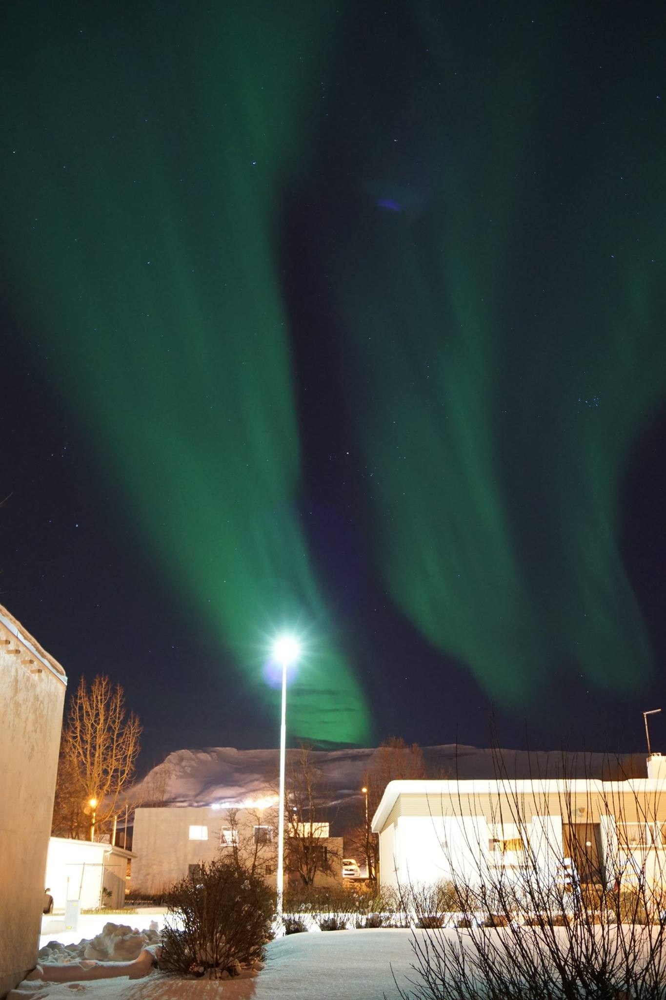
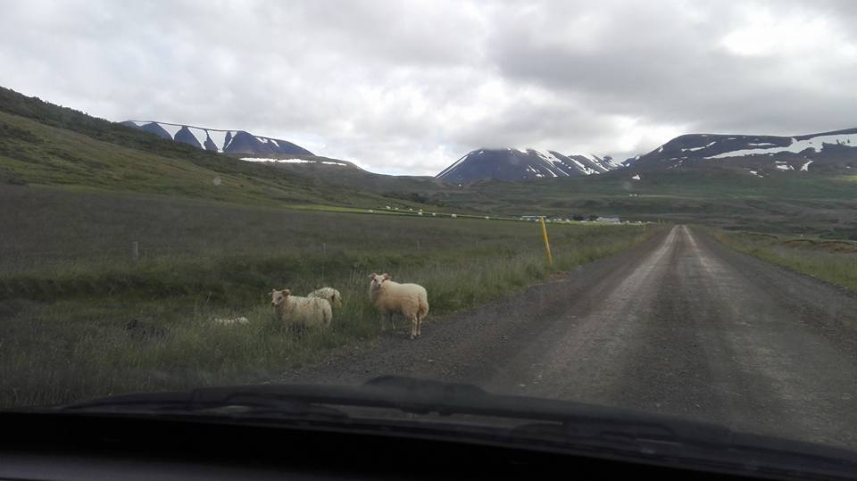
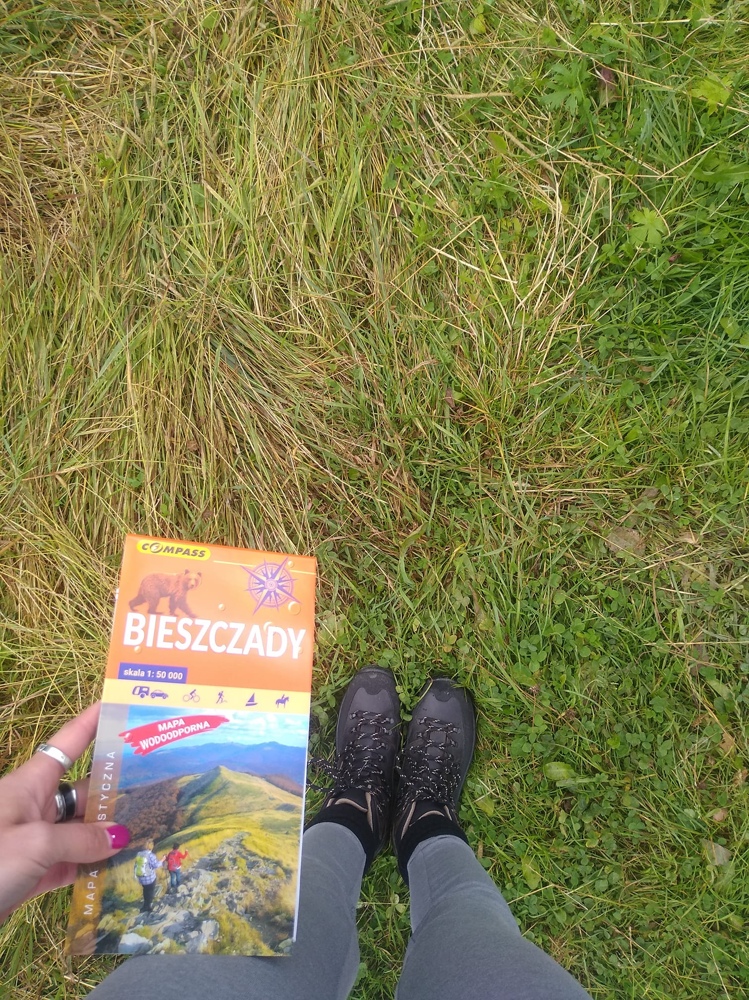

#  Welcome to my page, enjoy it!

Hi!
My name is Monika and I come from Poland. I'm Polish but I treat myself like a citizen of the World. Universe is my home. I'm almost 30 years old and I live in Dęblin, with my son, husband and 3 rats. Yes, rats - I love them! :) I like cycling and reading books - criminals (scandinavian are the best ones), reportages, (auto)biographies, something about meditation and mindfluence - a spiritual development.

Now, I'm process engineer in the production of welded structures. My main role is do the workshop drawings. Before this vacancy I used to work as a Assistant to Designer in electrical and telecom industries. I did a lot of documentation and projects in my life (e.g. executive project, civil engineering design - mainly electrical and telecom).

## Fun fact from my past.

I lived in Iceland for almost 2 years. I have been working in Becromal Iceland ehf (now: TDK foil Iceland ehf) as Laboratory Technician and Slitting Clerk. My son was born there and after giving a birth, togeter with husband, we decided to come back Poland and raise here our baby boy.

*Icelandic aurora borealis - photo taken close to house we live in, 2017*

*Icelandic sheep - photo taken in the middle of nowhere, 2017*

## Things I really like:

- guayusa or freshly ground coffee,
- burgers,
- Bieszczady mountains and nature
- my life! :)

*Bieszczady, 2020*

*"Życie jest piękne!" - "Life is beautiful!", 2020*

Any questions? Need more information? Contact to me:

e-mail: wilczyskamonika@yahoo.com

LinkedIn: https://www.linkedin.com/in/monika-wilczy%C5%84ska-mitura-634894136/
